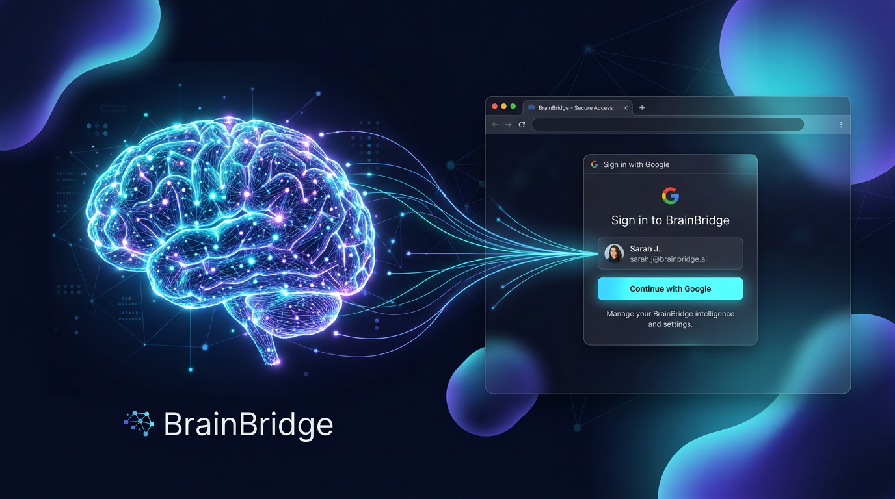

<p align="center"></p>

# BrainBridge — permanent memory for AI agents (via Google NotebookLM)

**Give any AI agent a brain that remembers.** BrainBridge is an MCP server that
connects Claude Code / Cursor / Codex / any MCP client to your **NotebookLM
notebooks ("brains")** — ask with citations, save memories as dated sources,
read everything back. Zero context loss.

> Auth is a **one-time Google popup** (`brain_login`) — no cookies, no copy-paste.
> Lazy auth: ANY memory tool auto-opens the popup when the session is missing.
> Fallback chain: popup (system Chrome → bundled Chromium) → silent browser cookies →
> clear instructions. A keepalive loop keeps the session alive for weeks.
> Your memory stays in your own Google account (cloud); this server runs **locally / self-hosted**.

---

## Tools (11)

| Tool | What it does |
|---|---|
| `brain_status` | Session health check (go/no-go) |
| `brain_list` | List all your brains (notebooks) with IDs |
| `brain_ask(question, brain)` | Query a brain — answers cite your sources |
| `memory_save(title, content, brain)` | Persist anything as a dated Markdown memory source |
| `memory_sources(keyword, brain)` | Search your memory archive |
| `memory_read(source_id, brain)` | Read a full entry |
| `memory_context(brain)` | Session-start digest — "what you already know" |
| `brain_login(browser)` | 🔐 Opens the Google sign-in popup (session auto-saves) |
| `brain_login_silent(browser)` | Silent auth from your installed Chrome/Firefox/Brave |
| `brain_logout()` | Clear local session (never signs you out of Google) |
| `brain_keepalive()` | Rotate the token now + report status |

## 🔁 Connection continuity — authenticate once, stay connected

1. **Persistence:** session stored in `~/.notebooklm/profiles/default/storage_state.json`
   (Playwright state) — every call reuses it, no re-login.
2. **Keepalive loop** (official cadence = 15 min):
   ```bash
   nohup ./keepalive.sh >/tmp/nblm-keepalive.log 2>&1 &   # rotates __Secure-1PSIDTS
   ./keepalive.sh check                                   # one-shot refresh + status
   ```
   Desktop: cron/launchd/systemd `*/15 * * * * /path/to/brainbridge/keepalive.sh check`.
3. **Tool-level:** `brain_keepalive` for refresh + status on demand.
   The bundled notebooklm MCP server also runs a `keepalive=600s` client task.

## 🚀 Quick start

```bash
./setup.sh              # pip deps + Playwright Chromium (for the login popup)
./run.sh                # start the MCP server (stdio)
# or: python3 -m brainbridge
```

**Connect to Claude Desktop / Cursor:**
```json
{
  "mcpServers": {
    "brainbridge": { "command": "python3", "args": ["-m", "brainbridge"], "cwd": "/absolute/path/to/brainbridge-mcp" }
  }
}
```

First time: call `brain_login` → Google popup → approve → everything just works.
If you changed browsers later: `notebooklm auth import-cookies <export>.json` is still supported.

## 🧠 Brains (`BRAIN_REGISTRY` in `brainbridge/server.py`)

Map brain keys to your notebook IDs. Default entries (example — **replace with yours**):

```python
BRAIN_REGISTRY = {
    "personal": {"id": "41538b98-f0ed-4110-baff-a348d8976563", "alias": "abdelkhalik", ...},
    "project":  {"id": "d3d08d6b-6185-44f8-997e-0c476c478e49", "alias": "artisanpro",  ...},
}
```

## 🔒 Security & hosting

- BrainBridge is **local/self-hosted by design** — do NOT deploy it publicly;
  it holds the session to your Google account.
- `.gitignore` excludes `storage_state.json*`, `cookies*.json`, `.env`.
- Logout only clears the local profile — never your Google session.

## 📦 License

MIT — see [LICENSE](LICENSE).

---

*Part of the BrainForge suite · built by [@DeadEnde](https://github.com/DeadEnde) · 2026*
